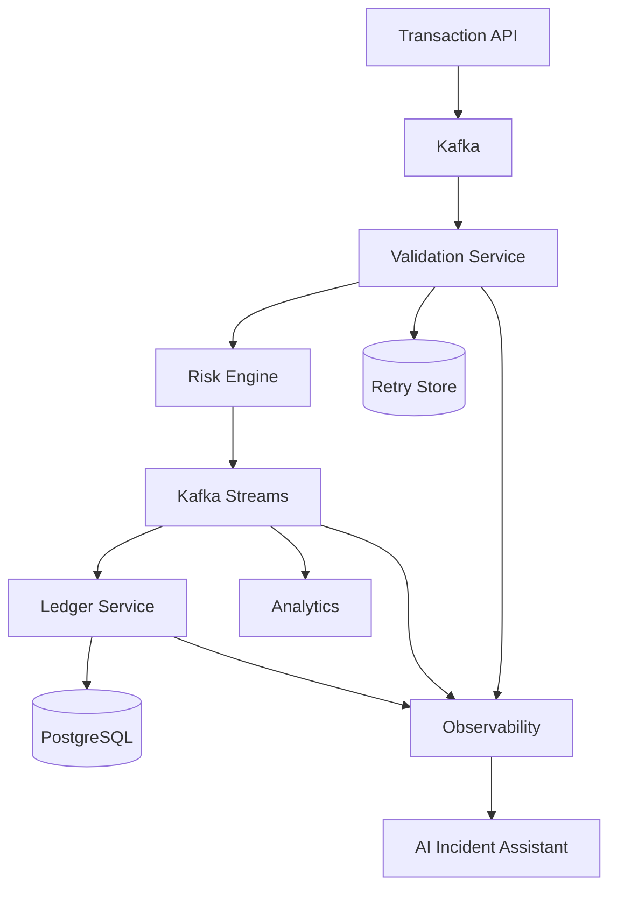
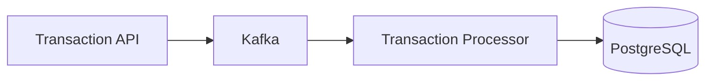

# Real-Time Payment Processing Platform

## 1. Project Vision

Build a fictional banking platform capable of receiving, validating, processing, and recording transactions in real time. The project is a Tech Lead-level demonstrator centered on Java, Spring Boot, Kafka, Kubernetes, observability, and thoughtful use of artificial intelligence.

The goal is not to stack technologies. Every component must address a measurable need: reliability, traceability, incident recovery, performance, or operational simplicity.

### Value Proposition

The platform must demonstrate that a transaction can:

1. be received through a secured API;
2. be published to Kafka;
3. be validated against business rules;
4. be processed without double-accounting;
5. be traced end to end;
6. withstand failures and restarts;
7. be analyzed quickly during an incident.

## 2. First Business Scenario

A client application sends a transaction:

```json
{
  "transactionId": "TX-2026-0001",
  "correlationId": "CORR-2026-0001",
  "accountId": "ACC-100",
  "amount": 250.00,
  "currency": "EUR",
  "type": "TRANSFER"
}
```

The expected outcome is:

- the API accepts a valid request and returns a tracking identifier;
- the `TransactionReceived` event is published to Kafka;
- the processor validates the amount, currency, and applicable rules;
- a valid transaction produces `TransactionValidated`;
- an invalid transaction produces `TransactionRejected`;
- the ledger records a validated transaction exactly once;
- sending the same `transactionId` again does not create any duplicate accounting entry.

## 3. Target Architecture



### MVP Architecture

The first version deliberately remains small:



The MVP contains neither Kubernetes, an Angular UI, nor an AI assistant. Those elements are added only after the core business flow is reliable and tested.

## 4. Repository Modules

```text
realtime-payment-platform/
├── docs/
│   ├── architecture/
│   └── adr/
├── transaction-api/
├── transaction-processor/
├── shared-contracts/
├── performance-tests/
├── deployment/
│   ├── docker-compose/
│   └── kubernetes/
├── pom.xml
└── README.md
```

### `transaction-api`

- exposes `POST /api/v1/transactions`;
- validates the request structure;
- requires an idempotency key;
- publishes `TransactionReceived`;
- returns an identifier used to track processing.

### `transaction-processor`

- consumes transactions;
- executes business rules;
- handles functional and technical errors;
- preserves ordering when required;
- records results idempotently.

### `shared-contracts`

This module contains shared event contracts only. It must not become a generic shared module containing all business logic.

### `performance-tests`

- generates realistic transactions;
- measures throughput and latency;
- injects duplicates and failures;
- verifies that there is no loss or double-accounting.

### `deployment`

Contains Docker Compose resources for local development, followed by Kubernetes manifests or Helm charts for deployed environments.

## 5. Technology Choices

| Area | Initial Choice |
|---|---|
| Language | Java 21 or 25 |
| Framework | Spring Boot 4 |
| Messaging | Kafka or Redpanda locally |
| Streaming | Kafka Streams 3.9.x |
| Database | PostgreSQL |
| Migrations | Flyway |
| Testing | JUnit 5, Mockito, Testcontainers |
| Observability | OpenTelemetry, Prometheus, Grafana |
| Containers | Docker, Kubernetes, Helm |
| Performance | Gatling or k6 |
| CI/CD | GitLab CI or GitHub Actions |

## 6. Non-Functional Requirements

### Reliability

- no duplicate ledger writes;
- no Kafka acknowledgement before the expected operation succeeds;
- controlled recovery after a restart;
- preservation of an actionable state when a dependency is unavailable.

### Performance

- progressively increase the target throughput up to 20,000 messages per second;
- measure p50, p95, and p99 latency;
- document behavior when the platform reaches saturation;
- define an explicit partitioning and sizing strategy.

### Traceability

- propagate `transactionId`, `correlationId`, and `traceId`;
- clients supply `correlationId` in the intake JSON body; preserve it in
  `TransactionReceived`, acceptance responses, and future downstream events;
- `transactionId` remains the business idempotency key; `correlationId` links
  related work across services and is separate from a distributed tracing `traceId`;
- use structured logs without sensitive data;
- expose technical and business metrics;
- provide distributed traces across the API, Kafka, processor, and ledger.

### Security

- authenticate and authorize API calls;
- keep secrets out of the Git repository;
- encrypt communications;
- mask sensitive data in logs;
- scan dependencies and images in CI.

## 7. Kafka Strategy

### Initial Topics

```text
transactions.received
transactions.validated
transactions.rejected
```

### Partitioning

The key choice depends on the required business guarantee. An `accountId` key preserves transaction order for one account, at the cost of a hot-partition risk for highly active accounts. A `transactionId` key distributes load more evenly but does not guarantee ordering per account. The decision must be recorded in an ADR.

### Idempotency

The strategy combines:

- a stable transaction identifier;
- a database unique constraint;
- transactional persistence;
- replay and restart tests;
- optionally, a deduplication store if requirements evolve.

### Processing Guarantees

The project must compare `at-least-once` delivery with business idempotency and `exactly_once_v2` for Kafka Streams. The claimed guarantee must be verified through failure tests, not inferred from configuration alone.

## 8. Observability

The primary indicators are:

- number of received, validated, and rejected transactions;
- incoming and outgoing throughput;
- p50, p95, and p99 latency;
- failure rate;
- consumer lag;
- retry-store size;
- number of detected duplicates;
- processing time by business rule;
- recovery time after an incident.

Dashboards must answer operational questions: Is the system still receiving messages? Where is latency increasing? Is a partition blocked? Is there a loss or an accumulation?

## 9. AI Incident Assistant

AI does not decide whether a financial transaction is valid or fraudulent. Critical rules remain deterministic, testable, and auditable.

The AI assistant acts as an operations support tool:

- summarize an incident from metrics, logs, and traces;
- retrieve relevant procedures from runbooks through RAG;
- suggest Kubernetes diagnostic commands;
- correlate an anomaly with recently deployed changes;
- prepare an incident report;
- propose actions subject to human validation.

The project must evaluate answer quality, control the sources used, limit data exposure, and prevent dangerous automatic execution.

## 10. Delivery Plan

| Phase | Deliverable | Indicative Duration |
|---|---|---:|
| 1. Walking skeleton | API to Kafka to processor to PostgreSQL | 1 week |
| 2. Reliability | Idempotency, errors, replay, and restart | 1–2 weeks |
| 3. Streaming | Kafka Streams aggregations and state stores | 1–2 weeks |
| 4. Observability | Logs, metrics, traces, and dashboards | 1–2 weeks |
| 5. Industrialization | CI/CD, Docker, Kubernetes, and Helm | 2 weeks |
| 6. Performance | Generator, load tests, and report | 1 week |
| 7. AI | RAG, runbooks, and incident assistant | 2 weeks |

### First Sprint

1. Write the requirement, primary scenario, and acceptance criteria.
2. Start Kafka or Redpanda and PostgreSQL through Docker Compose.
3. Create topics and Flyway migrations.
4. Implement the transaction intake endpoint.
5. Publish and consume `TransactionReceived`.
6. Record the transaction in the ledger.
7. Test duplicate submission and consumer restart.

The sprint is complete when the project starts with one command, `mvn verify` succeeds, and a two-minute demonstration is possible.

## 11. Demonstration Scenarios

### Duplicate

The same transaction is sent twice. Only one ledger entry is created and a metric counts the duplicate.

### Failure During Processing

The processor is stopped after consuming a message but before processing completes. After restart, the transaction is resumed without duplicate persistence.

### Slow Partition

An artificially slow rule creates consumer lag. The dashboard identifies the affected topic and partition.

### Ledger Unavailable

PostgreSQL becomes temporarily unavailable. The platform keeps a consistent state and resumes processing according to the documented strategy.

## 12. ChatGPT/Codex Development Support

ChatGPT/Codex can act as a development partner:

- shape user stories and acceptance criteria;
- propose and challenge the architecture;
- generate or modify code in the repository;
- write and run tests;
- analyze compilation errors and stack traces;
- perform quality, security, and concurrency reviews;
- produce manifests, pipelines, and dashboards;
- maintain the README, ADRs, and project status;
- prepare interview questions based on the decisions made.

Every development request should specify:

```text
Objective: expected outcome.
Context: modules, files, and error involved.
Constraints: architecture, versions, and rules to respect.
Done when: tests and behaviors that prove success.
```

An `AGENTS.md` file can preserve conventions over time: Java version, architectural structure, testing rules, validation commands, and security limits.

## 13. Definition of Done

A feature is considered complete when:

- its business behavior is demonstrable;
- its unit and integration tests pass;
- expected errors are handled;
- the required metrics and logs exist;
- documentation reflects the code;
- no sensitive data is exposed;
- limits and trade-offs are explicit.

## 14. Expected Portfolio Outcome

The final repository must include:

- an immediately understandable README;
- an architecture diagram;
- several short ADRs;
- a local startup procedure;
- reproducible tests;
- dashboard screenshots;
- a performance report;
- a five-minute demonstration video;
- a summary of simulated incidents and lessons learned.

The professional message conveyed by the project is clear: its author can design, secure, deploy, and operate a critical distributed system, measure its performance, and guide its evolution through explicit decisions.
